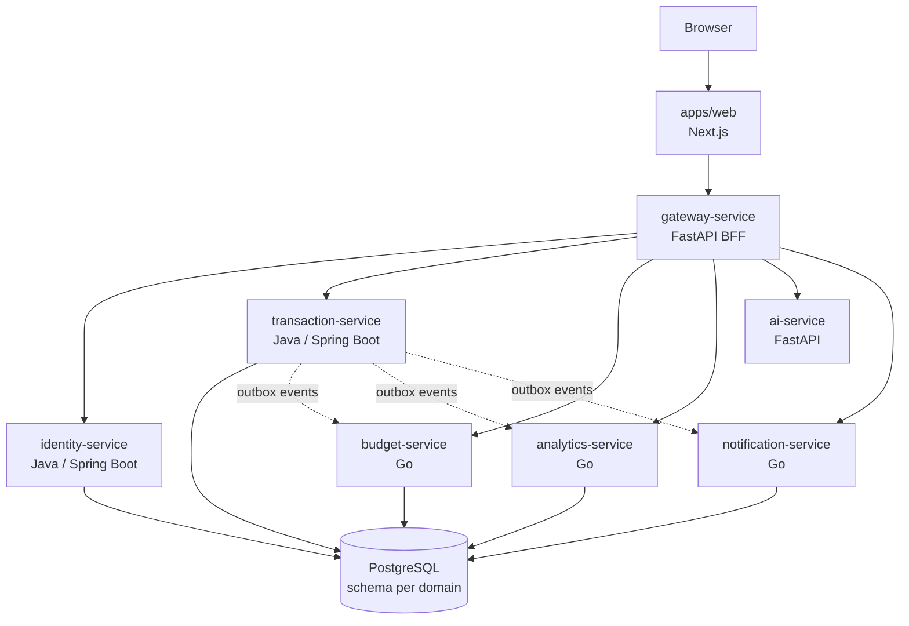

<div align="center">

# ai-finance-manager

### Personal finance, engineered with safety boundaries

A local-first personal finance platform for accounts, transactions, budgets,
analytics, notifications, and AI-assisted transaction drafts.

[](LICENSE)
[](docs/architecture/overview.md)
[](#project-status)
[](#safety-by-design)

**Next.js · FastAPI · Spring Boot · Go · PostgreSQL · AWS**

</div>

---

## What this project does

`ai-finance-manager` brings everyday money management into one application:

- Track cash, bank, and e-wallet accounts.
- Record income, expenses, transfers, categories, and reversals.
- Set monthly budgets and monitor spending thresholds.
- View a consolidated cash-flow dashboard.
- Create natural-language transaction drafts with rules or an LLM.
- Receive informational alerts and insights without giving AI control of the ledger.

The project is intentionally built as a polyglot microservice system. It is both
a usable finance application and a reference architecture for Java, Go, Python,
Next.js, event-driven workflows, and cost-aware AWS deployment.

## Safety by design

Financial software should make its boundaries obvious:

| Principle | Guarantee |
|---|---|
| Single browser entry point | The web app calls `gateway-service` only. |
| Ledger ownership | `transaction-service` is the source of truth for balances and entries. |
| Human confirmation | AI creates drafts; it never posts ledger entries or initiates transfers. |
| Precise money values | Amounts use integer minor units plus an ISO currency code—never floating point. |
| User isolation | Authorization derives from the authenticated JWT `sub`. |
| Auditable corrections | Posted entries are corrected with reversals instead of destructive edits. |
| Reliable writes | Create operations support idempotency; domain events use an outbox flow. |
| Secret isolation | AI keys and internal credentials remain server-side. |

## Architecture



In production, AWS API Gateway sits in front of the application
`gateway-service`. The two are different components: AWS API Gateway is
infrastructure at the edge; `gateway-service` is the Backend for Frontend (BFF)
that validates identity, composes responses, and hides internal services.

The locked architecture decision is documented in
[ADR 0004](docs/adr/0004-full-services-naming.md).

## Technology map

| Component | Stack | Responsibility | Local port |
|---|---|---|---:|
| [`apps/web`](apps/web) | Next.js 16, React 19, TypeScript, Tailwind | User interface | `3000` |
| [`gateway-service`](services/gateway-service) | Python 3.13, FastAPI | JWT edge and BFF composition | `8000` |
| [`ai-service`](services/ai-service) | Python 3.13, FastAPI | Draft extraction and insights | `8001` |
| [`identity-service`](services/identity-service) | Java 25, Spring Boot 4.1 | Profile and preferences | `8080` |
| [`transaction-service`](services/transaction-service) | Java 25, Spring Boot 4.1 | Accounts, categories, ledger, outbox | `8081` |
| [`budget-service`](services/budget-service) | Go 1.26 | Budgets and thresholds | `8082` |
| [`analytics-service`](services/analytics-service) | Go 1.26 | Dashboard read model | `8083` |
| [`notification-service`](services/notification-service) | Go 1.26 | In-app notification worker/API | `8084` |
| [`infra`](infra) | Docker Compose, Terraform | Local PostgreSQL and AWS foundations | `5432` |

## Repository layout

```text
ai-finance-manager/
├── apps/web/                   # Next.js application
├── services/
│   ├── gateway-service/        # Browser-facing BFF
│   ├── identity-service/       # Profiles and preferences
│   ├── transaction-service/    # Ledger source of truth
│   ├── budget-service/         # Budget domain
│   ├── analytics-service/      # Dashboard read model
│   ├── ai-service/             # AI/rules draft generation
│   └── notification-service/   # Alerts and notifications
├── packages/contracts/         # Shared API contracts
├── infra/                      # Compose and Terraform
├── docs/                       # Architecture and ADRs
├── scripts/                    # Repository utilities
├── AGENTS.md                   # Durable instructions for Codex and coding agents
└── Makefile                    # Canonical build and verification commands
```

## Run locally

### Prerequisites

| Tool | Required version |
|---|---|
| Docker Desktop | Recent version with Docker Compose |
| Node.js | `22+` |
| pnpm | `9+` |
| Python | `3.13+` |
| uv | `0.5+` |
| JDK | `25` with `JAVA_HOME` configured |
| Maven | `3.9+` |
| Go | `1.26+` |
| Make | Optional, but recommended for root commands |

### 1. Start PostgreSQL

```bash
make up
```

The Compose setup creates one PostgreSQL database with a separate schema and
database role for each domain service. Local defaults come from
[`.env.example`](.env.example) and contain development-only values.

If `make` is unavailable:

```bash
docker compose -f infra/docker-compose.yml --env-file .env.example up -d
```

### 2. Start the backend services

Run each command in a separate terminal from the listed directory:

| Service directory | Command |
|---|---|
| `services/identity-service` | `mvn spring-boot:run` |
| `services/transaction-service` | `mvn spring-boot:run` |
| `services/budget-service` | `go run ./cmd/server` |
| `services/analytics-service` | `go run ./cmd/server` |
| `services/notification-service` | `go run ./cmd/worker` |
| `services/ai-service` | `uv sync && uv run uvicorn ai.main:app --reload --app-dir src --host 127.0.0.1 --port 8001` |
| `services/gateway-service` | `uv sync && uv run uvicorn gateway.main:app --reload --app-dir src --host 127.0.0.1 --port 8000` |

Every backend exposes `GET /health` on its local port.

### 3. Start the web application

```bash
cd apps/web
pnpm install
pnpm dev
```

Open [http://localhost:3000](http://localhost:3000). In local development,
`AUTH_DEV_MODE` allows the gateway to issue a short-lived development JWT. The
browser still communicates only with `gateway-service`.

### 4. Stop local infrastructure

```bash
make down
```

## AI providers

The AI path is optional. Without an API key, the application uses a deterministic
rules provider and remains fully runnable offline.

| Provider | State | Configuration |
|---|---|---|
| Rules | Default | `AI_PROVIDER=rules` |
| Groq | Available | `AI_PROVIDER=groq` and `GROQ_API_KEY` |
| Gemini | Reserved | Not wired yet |

When launching `ai-service` from its directory, place local overrides in
`services/ai-service/.env` or export them in that terminal:

```dotenv
AI_PROVIDER=groq
GROQ_API_KEY=replace-with-your-local-key
GROQ_MODEL=llama-3.3-70b-versatile
```

Never commit `.env` files. Provider failures fall back to rules, and every AI
result remains a draft that must be confirmed before it reaches the ledger.

## Build, test, and verify

Canonical root commands:

```bash
make test      # Run all backend service test suites
make lint      # Lint and type-check the web app
make build     # Create the production web build
make verify    # Run backend tests and build the web app
```

Useful targeted commands:

```bash
make test-gateway-service
make test-ai-service
make test-budget-service
make test-analytics-service
make test-notification-service
make test-identity-service
make test-transaction-service
make lint-terraform
```

## Project status

The local MVP currently includes:

- Dashboard, accounts, categories, transactions, budgets, AI drafts, and profile UI.
- Gateway routes with local JWT authentication and request hardening.
- Ledger persistence, idempotency, reversals, and an outbox relay.
- Budget, analytics, and notification event consumers.
- Rules-based AI plus an optional Groq provider.
- PostgreSQL Compose setup and initial Terraform modules.

Still planned or incomplete:

- Production Cognito integration.
- SQS in place of the local HTTP outbox relay.
- Complete production Lambda/SnapStart packaging and deployment.
- Gemini provider implementation.
- Production observability and deployment hardening.

This repository is under active development and should not be treated as a
production banking system or a source of professional financial advice.

## Working with Codex or Cursor

No `.agent` or `.agnet` directory is required for Codex.

- [`AGENTS.md`](AGENTS.md) is the repository-level source of durable agent
  instructions, engineering constraints, and verification expectations.
- [`.cursor/`](.cursor) contains Cursor-specific context, rules, and prompts.
- A project `.codex/config.toml` should be added only when the repository needs
  Codex-specific runtime settings such as hooks, MCP, sandbox, or model defaults.
  It is intentionally absent today because the existing `AGENTS.md` is sufficient.

Human contributors should start here and in [`docs/`](docs). Coding agents must
also follow [`AGENTS.md`](AGENTS.md) before making changes.

## Documentation

- [Architecture overview](docs/architecture/overview.md)
- [UI architecture](docs/architecture/ui.md)
- [AI provider design](docs/architecture/ai-providers.md)
- [ADR 0004 — full services and naming](docs/adr/0004-full-services-naming.md)
- [Service documentation](services)
- [Infrastructure documentation](infra)
- [API contracts](packages/contracts)

## License

Released under the [MIT License](LICENSE).
